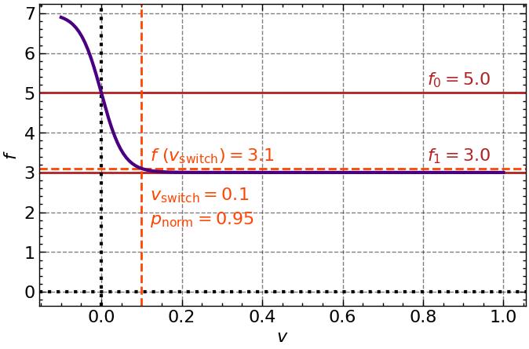

# The Rolling Ball Simulation

This program creates an animation of a ball starting from rest and rolling down along a surface defined with a mathematical function $f(x)$ given by the user. The model includes a possibility of slipping and rolling friction.

## 1. Structure

The `solve(func, ...)` function launches the numerical integration. Final position, energy vs. time and velocity vs. time are plotted if `do_plots=True`, and an animation is created if `do_animation=True`.

## 2. Input

The parameters assigned by the user are
- the surface function;
- time of simulation, precision (amount of computed data points per second);
- the coefficients of static, kinetic and rolling friction;
- the radius of the object, the coefficient in the object's moment of inertia that defines its shape (e.g., for a solid sphere, whose moment of inertia is $\frac{2}{5}MR^2$, this parameter would be $2/5$. If a hollow object is chosen, note that the appearance of the object's cross-section in the animation should be altered).

Notice that the mass is not defined because it is cancelled in the equations of motion. Hence the "forces" calculated in this program are actually accelerations and the "energy" is energy per unit mass. All the physical parameters are supposed to be in SI units.

## 3. Surface

The surface is input into the model by passing a `func = lambda x: ...` function to the `get_surface()` constructor. To input a parametic function, some changes in the code are required. The dimensions of the simulation box are pre-set as `xlim=100` and `ylim=100`, so it is preferred that the coefficients in the input function are adjusted to fit in. Some chages are required to to make the simulation box (and hence also the object's radius) automatically adjustable to any input function.

The `get_surface()` constructor creates an array wtih the six following parameters for each x-coordinate: 
- $x$, $y$;
- first and second derivative;
- angle with the $+x$ direction (using the slope);
- instantaneous radius of curvature, given by

$$\rho=\frac{[1+(\frac{dy}{dx})^2]^{\frac{3}{2}}}{\frac{d^2y}{dx^2}}.$$
 
Next, the constructor creates another array of the same shape, for the trajectory of the object with a radius `r_particle`, assuming the contact with the surface is never lost. Any point on the trajectory is `r_particle` units away from the surface. The coordinates for the trajectory are given in terms of the surface's parameters:
```python
x = x - r_particle * np.sin(angle)
y = y + r_particle * np.cos(angle)
```
Notice that the actual path of the object is not an elementary function (e.g., not a parabola) anymore. With this transition, if the object is located at `traj[i]`, its point of contact with the surface is at `surface[i]`. The slope and radius of curvature at object's current location are determined by picking a trajectory point with the closest $x$-coordinate to the object's current $x$-coordinate and using the parameters at that trajectory point. Due to a large amount of points, no interpolation nor using $\sqrt{x^2+y^2}$ for closest point determination is required at this level of accuracy. The radius of curvature must be obtained from the trajectory data by the definition of centripetal acceleration it will be used for; using the slope from the trajectory array (rather than surface array) empirically shows a slightly more accurate result. The slopes of the surface and the trajectory at a given $x$ do not differ significantly anyways. 
```python
index = np.argmin(np.abs(traj[:,0]-x))
angle  = traj[index, 4]               
radius = traj[index, 5]
```

## 4. Gravitational and Normal reaction force

Since the surface is curved and its angle of incline is constanly changing, the most convenient coordinate system choice is the orthogonal $xy$ system, with the the axes aligned horizontally and vertically. The components of the gravitational force (acceleration) in the present case are
```python
gravitya = np.asarray([0.0, -g])
```

On a curved surface with instantaneous slope angle $\theta$, the normal reaction force is compensating the component of gravity normal to the surface and creating the centripetal acceleration: 

$$N=g\cdot \cos \theta + \frac{v^2}{\rho},$$

(recall this "force" is actually an acceleration) where $g$ is gravitational acceleration, $v$ is absolute speed and $\rho$ is curvature radius at that site. The sign of $\rho$ is the same as of the corresponding second derivative. If the calculated $N$ is negative, the latter and all the friction forces are set to $0$, thus indicating a loss of contact with the surface. In this scenario energy conservation issues are possible as the program was not optimized for a contact loss scenari specifically.

The obtained normal reaction force modulus is then decomposed into $x$- and $y$-components, using the incline angle ($\theta$ or `angle`), which is positive for an increasing function and negative for a decreasing one:
``` python
normala = np.asarray([-normal_mod * np.sin(angle), normal_mod * np.cos(angle)])
```

## 5. Dry friction

In the present work, dry friction refers to static and kinetic friction, as opposed to rolling friction. On an inclined surface with instantaneous angle of incline $\theta$, the static friction force required to continue rolling without slipping is 

$$f=\frac{1}{i+1}\cdot g \cdot \sin \theta ,$$

where $i$ is the coefficient in the formula for object's moment of inertia, e.g., $i=\frac{2}{5}$ for a solid sphere. If the calculated static friction is larger than $\mu_s \cdot N$, where $\mu_s$ is the coefficient of static friction, static friction is set to that maximal value.

The kinetic friction regime is simply defined by $f=\mu_k \cdot N$, where $\mu_k$ is the coefficient of kinetic friction. The transition between the two regimes is ensured using a sigmoid function of the form 

$$f = \frac{-2(f_0 - f_1)}{1 + \exp{(-\frac{v}{v_{\text{norm}}}})} + (2f_0 - f_1), \qquad (1)$$

where $f_0$ is friction force for the case $v=0$, and $f_1$ is for the non-zero speed case. Normalization velocity $v_{\text{norm}}$ is given by 

$$v_{\text{norm}}=\frac{v_{\text{switch}}}{\ln{\frac{1+p_{norm}}{1-p_{\text{norm}}}}},$$

where $v_{\text{switch}}$ is the velocity at which the transition from $f_1$ to $f_0$ starts and $p_{\text{norm}} \in (0,1)$ ensures that $f_0 - f(v_{\text{switch}}) = p_{\text{norm}} \cdot (f_0 - f_1)$. For example, if $p_{\text{norm}}=0.95$, $f(v_{\text{switch}})$ is located $95\%$ on the way from $f_0$ to $f_1$. The value $95%$ is visually close to the point with maximum curvature, i.e., where the transition effectively starts. In the simulation, the two parameters were set to $p=0.95$ and $v_{\text{switch}}=0.1$. These values have no rigid justification. Figure 1 provides an example sigmoid function $f(v)$ for $f_0= 5.0$ and $f_1=3.0$. Actual $f_0$ and $f_1$ values depend on physical parameters of the system at a given moment of time. Physically function $(1)$ expects a positive $v$ input, as the magnitude of the friction force does not depend on its direction.



$$ \text{Fig.1} $$

For the kinetic ($f_1$) → static ($f_0$) friction transition as $v→0$, the slip velocity is used. First, the signed tangential velocity is calculated as 

$$v_{\text{tan}} = v_x \cdot \cos\theta + v_y \cdot \sin\theta,$$

has the same magnitude as $\sqrt {v_x^2+v_y^2}$ and is positive when $v_x$ is positive. The slip velocity, which is the absolute velocity of the point of contact (zero in case of rolling without slipping) is calculated as 

$$v_{\text{slip}} = v_{\text{tan}}-\dot{\phi}r,$$

and the has the same sign convention as $v_{\text{tan}}$. In the code, `vtan = vx * np.cos(angle) + vy * np.sin(angle)` with a plus sign because the positive rotational direction is counterclockwise (it is bound to `matplotlib` angle sign convention, when the image is rotated in the animation), but the object rotates clockwise when rolling down an incline,  left to right. To obtain the friction force value, the abslute vlue of $v_{\text{slip}}$ is passed to the Eq. (1). The direction of friction force is along the instantaneous tangent to the surface and opposite to that of $v_{\text{slip}}$. It is empirically established that, in this model, `vslip` is a tiny positive number if the object is effectively rolling without slipping, so there is no need to introduce extra `if` clauses to set the direction of static friction force.

## 6. Rolling friction

The rolling friction phenomenon is also called rolling resistance. In the present text, the "friction" name is used because the effect on object;s dynamics is similar to that of dry friction.

The rolling friction is determined by the dimensionless coefficient of rolling friction $c$ (`crf` in the code). It is defined as $f_r=cN$, where $f_r$ is rolling friction force and $N$ is the normal reaction force. The dimensionless coefficient is connected to the ususal coefficient of rolling friction $b$, which has untits of length, as $c=\frac{b}{\sqrt{r^2-b^2}} \approx \frac{b}{r}$, where $r$ is the radius of the object. The latter approximation is valid because $c$ is typically of order $10^{-3}$ to $10^{-2}$.

The adopted rolling friction model is valid for rolling without slipping. In the case of rolling with slipping, it is assumed that the micro-slipping effects are already considered in the kinetic friction. A sigmoid-aided transition from $f_0=f_r$ to $f_1=0$ is performed, making use of Eq. $(1)$. The direction of the rolling friction force is set in the same manner as that of dry friction forces. These two types of friction forces are stored as separate variables because of their different ways of doing work.

The total friction force is a simple sum of the dry and rolling friction. The total friction forces is decomposed into $x$- and $y$-components similarly as the normal reaction force, demonstrated earlier. The total force (acceleration) is calculated as the sum of the gravitational, normal and frictinal forces by components.
```python
friction_signed = dfriction_signed + -rfriction_signed
frictiona = np.asarray([friction_signed * np.cos(angle)
accel = gravitya + normala + frictiona
```
"`d`" and "`r`" before "`friction`" stand for "dry" and "rolling", respectively.

## 7. Rotation

The angular acceleration $\ddot{\phi}$ about the object's center of mass is computed as 

$$ \ddot{\phi}= \frac{f_d+f_r}{ir} + \frac{N b}{i r^2}\cdot\text{sgn}(-\dot{\phi}).$$

Here, $f_d$ and $f_r$ are the dry androlling friction respectively; $i$ is the coefficient in the moment of inertia expression (see Section 2); $c$ and $b$ are the dimensionless and dimensional coefficient of rolling friction, respectively (see Section 5). The sign of the first term is defined by the sign of $f_{d,r}$, which are positive to the right along the slope. The second term is caused by the displacement of the normal reaction force by $b$, which is a part of the definition of rolling friction. This term is always acting to decrease the angular velocity.

## 8. Numerical Integration

The translational and rotaional accelerations calculated via the forces and torques above are calculated inside the `Derivatives()` function which returns `statedot = np.asarray([vx, vy, accel[0], accel[1], phidot, phiddot, dworkdot, rworkdot])`. The `Derivatives` function is then passed to `scipy.integrate.solve_ivp()` along with the initial conditions and integration boundaries. `solve_ivp()` returns a `state` array where each parameter is the antiderivative of the corresponding parameter in `statedot`: `[x, y, vx, vy, phi, phidot, dwork, rwork]`. This list is unpacked in the beginig of `Derivatives()` function, e.g. `x  = state[0]`, and the state values are used to compute the derivatives at the next time point. 

The fact that the highest-order derivatives like accelerations cannot be accessed directly is a problem for testing the code. Although the accelerations could be saved in a separate array or printed while the `Derivatives()` function is called, the resulting values cannot be comapred to the time points of the solution as the integrators use adaptive timesteps and compute more derivatives than they output.

## 9. Work and Energy parameters

To check the correction and execution of employed equations of motion, energy balance is calculated for the object and the whole system. The energy per unit mass of the object is a sum of its potential gravitational, kinetic translational and kinetic rotational energy:

$$E=g\cdot y + \frac{v_x^2+v_y^2}{2} + \frac{ir^2 \cdot \dot{\phi}^2}{2}.$$

The energy array is computed for each time point after the main solution array is obtained.
```python
stateout = sci.solve_ivp(Derivatives, y0=stateinitial,
                        t_span=(0.0, tmax), t_eval=tout, method=method, max_step=dt,
                        args=(r_particle, mukin, mustat, crf, icoef, traj, g))
y = stateout.y[1]
phidot = stateout.y[5]
v = np.asarray([np.linalg.norm([stateout.y[2,i], stateout.y[3,i]]) for i in range(len(stateout.t))])
energy = g*y + v**2/2 + icoef*r_particle**2*phidot**2/2
```

On the other hand, the work done by reaction forces is computed along with the other parameters of the system in the main numerical integration part because it requires access to the force variables which cannot be accessed outside the function (see Section 7). The rate of change of work done by dry (namely kinetic; static friction does no work) friction is computed as $\dot{W_d}=f_d \cdot v_{\text{slip}}$. 

Rate of change of work done by rolling friction is currently calculated as the work of the torque about the center of mass caused by the normal reaction force $N$ being offset by $b$: $\dot{W_r}=N\cdot b \cdot \dot{\phi}$. The previous  *force* times *slip* formula cannot be used directly because the adopted rolling frictiton model implies rolling without slipping, so the macro-slip velocity is essentially zero. The empolyed technique showcases a good, but imperfect result (the total energy of the system after some time is close to the initial energy, but is slightly lower). A better method could be suggested for deriving this parameter.

Both work parameters are stored as positive to simplify futher operations. The total energy of the system at any time point is computed as $E_T = E + W_d + W_r$, and is expected to be constant. The deviation from initial energy value is defined as $\Delta E = \frac{E_T-E_0}{E_0}$, where $E_0$ is the energy of the object, equal to the wnwegy of the system at $t=0$. This parameter is demonstrated in the animation and expressed in percent to qualitatively analyse if a given deviation is crucial.

## 10. Animation

The animation is created using `matplotlib.animation` module. First, a figure is created, containing
- a patch depicting the object;
- an image clipped to the patch (to illustrate the rotation);
- the object's path that appears as the patch moves;
- a stationary surface polygon;
- a stationary trajectory line;
- text boxes for time-dependent parameters:
   - `t` -- time;
   - `vt` -- translational velocity;
   - `vR` -- angular velocity times radius of the object;
   - `d` -- displacement from the initial position;
   - `ΔE` -- relative change in total energy of the system (should be zero if works correctly).

Then, the varying parameters, namely,
- the position of the patch;
- the rotation angle of the image;
- the data for the path line;
- the numerical values of the physical parameters

are reset at each frame. These changes are stated in `animate()` function which is the passed to `matplotlib.animation.FuncAnimation()` function. One second of animation corresponds to one second of a real-world system. The amount of frames per second is specified for the animation as `fps_ani=20` and is independent of the `fps` parameter for numerical integration which determines the timestep in the solution array. The latter should therefore be greater or equal to `fps_ani` and be devisible by `fps_ani`. 


